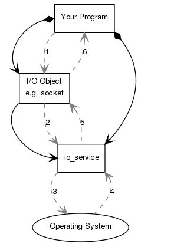
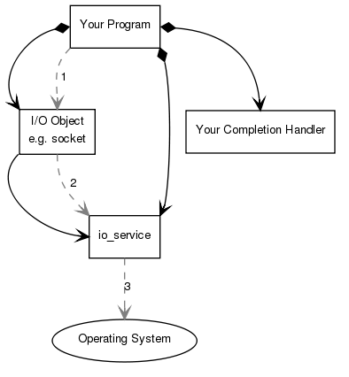
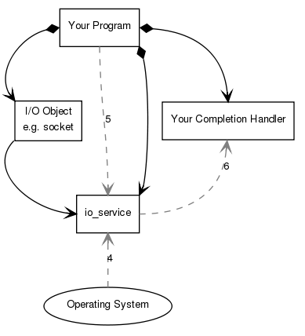
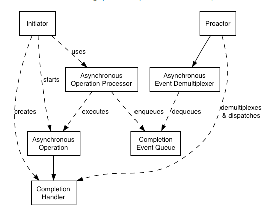

### Server architecture


[Boost.Asio](http://www.boost.org/doc/libs/1_64_0/doc/html/boost_asio.html)


+ _core concepts_
    + `io_service`, interface with OS resource 
        ```cpp
        boost::asio::io_service io_service;                 // link to OS's I/O
        boost::asio::ip::tcp::socket socket(io_service);    // I/O object, 
        ```
    + 
    + _synchronous connection_
        ```cpp 
        boost::system::error_code ec;
        socket.connect(server_endpoint, ec);               
        /* 
            1. initiates connection
            2. I/O object forwards request to io_service 
            3. io_service calls OS to perform connect operation
            4. OS returns result to io_service
            5. io_service forwarded backup to I/O object 
        */
        ```
    + _asynchronous connection_
        + 
        + 
        ```cpp
        void completion_handler(const boost::system::error_code& ec);
        socket.async_connect(server_endpoint, completion_handler);
        io_service::run();
        /* 
            1. initiate connect operation by calling I/O object
            2. I/O object forward request to io_service
            3. io_service signal OS for an async connect
            4. Time passes... OS indicate connect completed by placing result on a queue, ready to pick up by io_service
            5. program make call to io_service::run()
            6. io_service dequeue result of operation, translates to error_code, then pass it to completion handler
        ```
+ _Proactor design patter, concurrency without threads_
    + 
    + _async operation_ 
        + i.e. async read write on a socket 
    + _async operation processor_
        + execute async operations and queues event on completion event queue when operation completed
        + i.e. `stream_socket_service`
    + _completion event queue_
        + buffers completion events until dequed by async event demultiplexer
    + _completion handler_
        + process result of async operation, 
        + i.e. function objects, 
    + _async event demultiplexer_
        + blocks waiting for events to occur on completion event queue, and return a completed event to its caller
    + _proactor_
        + calls async event demultiplexer to dequeue events 
        + and dispatches the completion handler (i.e. invoke function object) associated with events 
        + i.e. `io_service`
    + _initiator_
        + app-specific code that starts async operation 
        + i..e `basic_stream_socket`
+ _Impl using reactor_
    + _async operation processor_
        + a reactor implemented with `select`, `epoll`, or `kqueue`
        + when it indicates resource is ready to perform an operation, the processor 
            + executes asyn operation and 
            + enqueues associated completion handler on completion event queue
    + _completion event queue_
        + a linked list of completion handlers 
    + _async event demultiplexer_
        + waiting on an evenrt/conditional variable until a completion handler is available in the queue
+ _threads_
    + _safety_  
        + `io_service` is safe 
    + _thread pools_
        + multiple threads may call `io_service::run()`
        + so any thread in the pool may invoke completion handler
    + _internal threads_
        + async completion handlers will only be called from threads that are currently calling `io_service::run()`
+ _threads without explicit locking_
    + _strands_
        + a strictly sequential invocation of event handler (on concurrent invocation, )
        + allows execution of code in multithreaded program without the need for explicit locking 
    + _usage_
        + _implicit_
            + calling `io_service::run()` on a single thread means all event handler execute in an implicit strand
                + since handler are invoked inside `run()` only
        + _explicit_
            + with `io_service::strand()`
            + event handler function object needs to be 
                + wrapped using `io_service::strand::wrap()`
                + or posted/dispatched via `io_service::strand` object
+ _buffers_
    + I/O invovles transfer of data to/from contiguous region of memory, called buffers 
    + _scatter-gather operation_
        + scatter-read receives data into multiple buffers 
        + gather-write transmits multiple buffers
    + _abstraction for a collection of buffers_
        + define a type to represent a single buffer and 
            ```cpp
            typedef pair<void*, size_t> mutable_buffer;
            typedef pair<const void*, size_t> const_buffer;
            ```
        + store them in a container
            + `MutableBufferSequence` and `ConstBufferSequence` define concepts of such container 
            + i.e. `vector`, `list`
    + `mutable_buffer` and `const_buffer` classes 
        + provide opaque representation of contiguous memory
        + `mutable_buffer` can be converted to `const_buffer`
        + protection against buffer overruns
            + ranges not over bound 
        + type-safety violation requested with `buffer_cast`
    + `boost::asio::basic_streambuf` 
        + derived from `std::basic_streambuf`
        + associate input sequence and output sequence with one or more objects of some char array type,
        + methods 
            + `ConstBufferSequence data()`
                + access input sequence of streambuf
            + `const_buffers_type prepare()`
                + return object of type `const_buffers_type` satisfies `ConstBufferSequence` concept, representing all char arrays in input sequence
            + `void commit(size_t )`
                + append `n` chars from start of output sequence to input sequence
                + beginning of output sequence advanced by `n` chars
            + `void consume(size_t n)`
                + remove `n` chars from beginning of input sequence
    + _Bytewise traversal of buffer sequences_ with iterator
        + `buffers_iterator<>`
            + allows traversal of buffer  (`MutableBufferSequence` or `ConstBufferSequence`) as though they were contiguous sequences of bytes
        + read single line from a socket into `string` write 
            ```cpp
            boost::asio::streambuf;

            std::size_t n = boost::asio::read_until(sock, sb, '\n');
            boost::asio::streambuf::const_buffers_type bufs = sb.data();
            std::string line(
                boost::asio::buffers_begin(bufs),
                boost::asio::buffers_begin(bufs) + n);
            ```
    + _debugging buffer_
        + 


### Boost.Asio API

+ `io_service`
    + goal 
        + implements an extensible, type-safe, polymorphic set of IO services, indexed by service type 
        + manages logical interface to OS on behalf of IO object.
            + i.e. resources shared across a class of IO objects
    + is thread safe 
    + provide core IO functionality including 
        + `boost::asio::ip::{tcp, udp}::{socket, acceptor}`
    + stop `io_service` from running out of work 
        `boost::asio::io_service::work work(io_service)`
+ `io_service::run()`
    + blocks until 
        + all work has finished and there is no more handler to be disaptched
        + or `io_service` stopped
+ `deadline_timer`
    + `async_wait(WaitHandler handler);`
        + initaite async wait against timer, always return immediately 
        + supplied handler called exactly once, when 
            + timer expired 
            + timer cancelled, in which case handler is passed error code `boost::asio::error::operation_aborted`
        + `void handler(const boost::system::error_code& error)`
+ `io_service::strand`
    + provides ability to post/dispatch handlers with guarantee that none of those handlers will execute concurrently 
+ `strand::wrap(Handler)`
    + craete a new handler (functor) that automatically dispatches the wrapped handler on the strand 
    + used to create a new handler object that, when invoked, will automatically pass the wrapped handler to the strand's dispatch function


### Boost.Asio 


[Python SimpleHTTPserver](https://docs.python.org/2/library/basehttpserver.html#BaseHTTPServer.BaseHTTPRequestHandler.error_message_format)

_server_ 
+ _classes_
    + _A simple HTTPServer_
        + create with 
            + server name + port 
            + a request handler
            ```py
            PORT = 8000
            Handler = SimpleHTTPServer.SimpleHTTPRequestHandler
            httpd = SocketServer.TCPServer(("", PORT), Handler)
            ``` 
        + creates and listens to HTTP socket, dispatch request to handler
    + _request handler_
        + parses header+request+url
            + headers
            + request command (GET)
            + request path
            + input stream
        + call correct handle based on route + Verb
            + base class for handles
        + methods 
            + `handle`
            + `send_error`
            + `send_response`
            + `send_header`, write header to output stream
        + variation 
            + base class 
            + derived class that maps path to directory path
    + _response generator_
        + response
    + _logging_
        + logs traffic
+ _utils_
    + _parser_  
        + parse header+request 
        + parse url
    + _encoder/decoder_
        + encode/decode url
    + _JSON formatter_
        + wrapper around json
    + _error_
        + specifies 
            + format
            + header content (i.e. content-type `text/html`)
        + generates HTTP status code + error message 
+ _relevant terms_
    + _client address_, consisting of host and port
    + 


